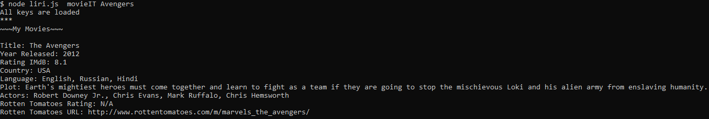

# Liri

>    

Click  [LIRI](https://drive.google.com/file/d/10wERT1wzWzH6ucsngj7dFqolY79atlw4/view) to watch the app in action.

## Getting Started
____
> 
### Prerequisites
* **VSC** `installed`
* **`Bash Terminal`**
* `Node Package Managers`
`Twitter`
`Spotify, node-spotify-api`
`Request`
`fs`
* **Create your Remote and clone to local Repo**
_Initiate your Node packages with **`npm init -y`**_
_You should have your `.gitigore` **file** created first_
* _Use `Screencastify` to **record** and **share**_

```
HomeWork Instructions and Googling a lot !
```


## Running the tests

**`click`** [**`LIRI`**](https://drive.google.com/file/d/10wERT1wzWzH6ucsngj7dFqolY79atlw4/view) **`link to watch the app.`** 

## Built With
* [NODE.js](https://nodejs.org/en/) | `Node.js® is a JavaScript runtime built on Chrome's V8 JavaScript engine`
* [NPM](https://www.npmjs.com/) | ` is the package manager for javascript` 
* [_BASH GIT terminal_](https://git-scm.com/downloads) | `Git is a free and open source distributed version control system designed to handle everything from small to very large projects with speed and efficiency..`
* [**jQuery**](https://jquery.com/) | `is a fast, small, and feature-rich JavaScript library.`

 

## Authors

> **Sergio Burca** -  - [*GitHub*](https://github.com/mecaniser)
## License

This project is licensed under the MIT License - see the [LICENSE.md](LICENSE.md) file for details
